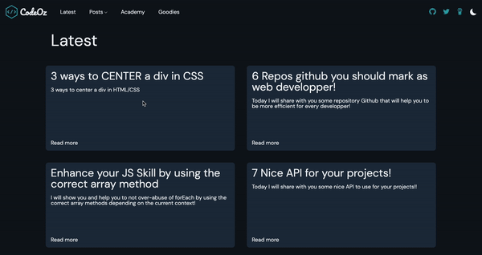
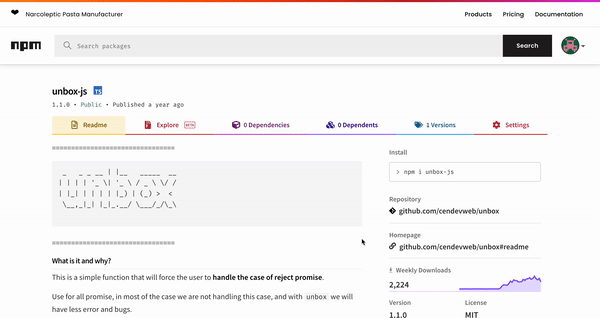

  

<h1 align="center">Hi  I'm Code-Oz</h1>

<!-- Intro -->

    
    <h3 align="center">Love JS, love writting dev article and share my knowledges</h3>
    <h3 align="center">I'm web developper and I make some application, writting some articles and making video on youtube for french 🥖 web dev</h3>

<!-- Social network -->

    

        
    

    

        
    

    

        
    

    

        
    
    

&nbsp;

<!-- Projects -->
<h1 align="center">My latest projects 👨‍💻</h1>

  <table>
        <tr>
            <td width="50%">
                <h3 align="center">
                    <a href="https://codeoz-blog.com/" target="_blank" rel="noreferrer">My Blog 📰</a>
                </h3>
                

                    
                    

                        This is my own blog where I share my knowledges
                    

                

            </td>
            <td width="50%">
                <h3 align="center">
                    <a href="https://www.chillflix.art/" target="_blank" rel="noreferrer"> Chillflix 🎶</a>
                </h3>
                

                    
                    

                        A chill radio from youtube to listen Lo-Fi music without being disturbed
                    

            

            </td>
        </tr>
        <tr>
            <td width="50%">
                <h3 align="center">
                    <a href="https://cacabox-tv.com/" target="_blank" rel="noreferrer">CCbox TV 📹</a>
                </h3>
                

                    
                    

                        A netflix like for the Youtube Channel Cacabox TV
                    

                

            </td>
            <td width="50%">
                <h3 align="center">Unbox JS 📦</h3>
                

                    
                    
                    

                        npm repository
                    

            

            </td>
        </tr>
        <tr>
            <td width="50%" align="center">
                <h3 align="center">
                <a href="https://codeoz.gumroad.com/l/RXLYp" target="_blank" rel="noreferrer">Underrated skill in javascript 📚</a>
                </h3>
                

                    
                    

                        This book is for all javascript developers that want to learn unpopular things about javascript
                    

                

            </td>
            <td width="100%" align="center">
                <h3 align="center">Others ...</h3>
                

                

                    

                        <a href="https://marketplace.visualstudio.com/items?itemName=code-oz.what-is-operator-javascript" target="_blank" rel="noreferrer">What is operator javascript 🔌 </a>
                        

                            I created an operator lookup plugin for all VSCode user!
                        

                    

                

                

                    

                        <a href="https://github.com/Code-Oz/youtube-dl-front" target="_blank" rel="noopener" > YT Downloader 🛠</a>
                        

                            I created a youtube downloader that manage video & playlist
                        

                    

                

                

                    

                        <a href="https://chrome.google.com/webstore/detail/beta-twitch-plus/ahdoacgdgcgkhmajnmibefppffbbkgnl?hl=fr&authuser=0" target="_blank" rel="noopener"> Twitch plus 🤖</a> 
                        

                            Chrome extension that improve your experience on twitch
                        

                    

                

                

                    

                        <a href="https://www.npmjs.com/package/liftp-js" target="_blank" rel="noopener"> liftP JS 📦</a> 
                        

                            NPM Package to modify a sync function into an async function without manage parameters
                        

                    

                

                

                
  
            </td>
        </tr>
  </table>

<!-- Technos -->
<h1 align="center">Languages and Tools 🛠</h1>

<h3 align="center">Basics</h3>

    
    
    

<h3 align="center">Front</h3>

    
    
    
    
    

<h3 align="center">Backend</h3>

    
    
    
    
    
    

<h3 align="center">Others</h3>

    
    
    
    

<!-- Contact -->
<h1 align="center">How to get in touch?</h1>
<h3 align="center">If you need my expertise for your project 👇</h3>

    - <a href="https://twitter.com/messages/compose?recipient_id=1270463775309795333" target="_blank" rel="noopener"> You can send me message on twitter</a>

 

    - <a href="mailto:codeoz.pro@gmail.com">Send email</a>
    

    

  

    

